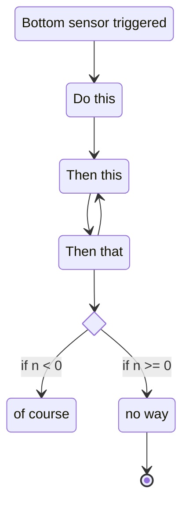

> This is a template with some example details (which might not make sense realistically) for a subsystem specification document. Use the format in this template and fill the details that match your subsystem.
> Note: DO NOT copy the quotes (any line starting with `>`) when creating your copy.
>
> Things to think about when writing this document:
> - [**YAGNI**](https://en.wikipedia.org/wiki/You_aren%27t_gonna_need_it): Don't create stuff you won't be using.
> - **Naming**: Are variables and command names clear and concise?
> - **Types**: Minimize usage of types and use everywhere the best type possible ([`Measure<>` objects](https://docs.wpilib.org/en/latest/docs/software/basic-programming/java-units.html), `Rotation2d`, etc.).
> - **Decoupling**: Your code needs to be encapsulated well -- functions do one thing, commands aren't different for autonomous and teleoperated, no unrelated code here, etc.
> - **Standards**: Does this code fully adheres to the [team standards document](https://docs.google.com/document/d/1qY1M03Skq-oFGJyZ3J_Y0o0QDthhFiaAKVMJ4-hPrRU/edit)?

# Conveyor Specification
The conveyor subsystem is responsible for moving balls from the intake to the shooter.
## Hardware
Motors:
- 1 BAG motor powered by a Talon SRX at the lower part of the conveyor. Name: (`Lower conveyor`)
- 2 Kraken X60s powered by Talon FXs in the middle part. Name: (`Middle conveyor master`, `Middle conveyor slave`)
- 1 NEO 550 powered by a SPARK MAX that controls the balls gate. Name: (`Balls gate`)

Sensors:
- 1 [REV Magnetic Limit Switch]([url](https://www.revrobotics.com/rev-31-1462/)https://www.revrobotics.com/rev-31-1462/) for zeroing the gate's position
- 2 DigiKey 123456 proximity sensors -- one at the bottom and another in the middle
Actuators:
- 2 double solenoid pistons at the lower part of the subsystem
## IO
### Inputs
- Lower proximity sensor state (`isBallSensedAtBottom`)
- Middle proximity sensor state (`isBallSensedInMiddle`)
- Speed  (`speed`)
- Gate limit switch state  (`isGateAtLimit`)
### Outputs
- Amount of balls (`ballsAmount`)
- Speed setpoint (`speedSetpoint`)
### IO functions
- `Measure<Temperature> getBallTemperature()`
### Subsystem functions
- `int getBallsAmount()`
- `Measure<Distance> getAverageBallLength()`
## Command methods
- `ejectBall()`
- `receiveBall()`
- `passBallsFromBottomToMiddle(double amount)`
- `passBallFromBottomToMiddle()` will call `passBallsFromBottomToMiddle(1)`. Useful when using [method references](https://docs.wpilib.org/en/stable/docs/software/basic-programming/functions-as-data.html#method-references).
## State machines/superstructure
> Not mandatory. See the [Mermaid docs](https://mermaid.js.org/intro/) for more information.

## Dashboard
### Development
> Mention here fields you will send over NetworkTables which will be shown during development and testing of the subsystem. Include a "Pit testing" subheading if another dashboard tab should be created for competition pit checks,
- `Measure<Temperature> averageBallsTemperature`
- `double kP`
### Driver dashboard
- Include here only fields which are crucial for the driver to see during the match.

## LEDs patterns
> Optional.
- LEDs are green, length is proportional to balls amount.
- Slow green blink when reaches max balls amount.
- Quick red blink when exceeds max balls amount.

## Other
> Anything else not covered by this template.

A profile generator will run on the coprocessor, and will feed data through the following NetworkTables topics:
- Inputs:
  - `/Robot/Subsystems/conveyor/generator/ballsAmount` -- amount of balls the conveyor currently holds. 
- Outputs:
  - `/Robot/Subsystems/conveyor/generator/speed` -- speed the conveyor should run in.
